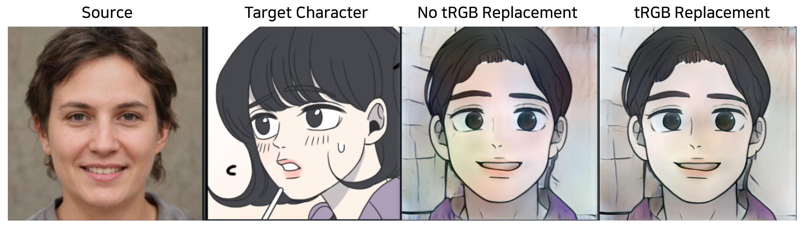

# Cross-Domain Style Mixing for Face Cartoonization 
** Now I am Refactoring, Re-Training and Testing for reproducting and checking paper's experiments
## Overview
- This repository contains an PyTorch implementation of ["Cross-Domain Style Mixing for Face Cartoonization"](https://arxiv.org/abs/2205.12450)
- You can check with more variable images in [webtoon/WebtoonME](https://github.com/webtoon/WebtoonMe)  ( you can use simple web demo )

> [Mark Kim](https://github.com/jis478/)   ·   [Jihye Back](https://github.com/happy-jihye/)   ·   [Namhyuk Ahn](https://nmhkahn.github.io/)   ·   [Kwangho Lee](https://github.com/khlee369/)<br>
> Project Page:  [English](https://webtoon.github.io/WebtoonMe/en)  |  [한국어](https://webtoon.github.io/WebtoonMe/)  |  [WebtoonMe demo](https://webtoon.github.io/WebtoonMe/app.html)
> 
> 🚧 🔧 🛠️ 👷
> 
> Now you can experience the demo app for image translation. Stay tuned for the video version let alone more Webtoon characters!😎
> 
> Also check out our paper, ["Cross-Domain Style Mixing for Face Cartoonization" ](https://arxiv.org/abs/2205.12450), specifically built for this project.


<br><br>
## Table of Contents
- [Getting Started](#getting-started)
  - [Paper List for CDSM Implementation and Understanding](paper-list-for-cdsm-implementation-and-understanding)
  - [Dependencies and Installation](dependencies-and-installation)

- [Preparation ( Collecting Data & Training )](#preparation)
  - [Preparing Webtoon Dataset](#preparing-webtoon-dataset)
  - [Preparing Generator](#preparing-generator)
  - [Preparing Restyle Encoder ( GAN Inversion )](#preparing-restyle-encoder)
  - [Pretrained_Weights](#pretrained_weights)

- [Generation( CDSM )](#generation)
  - [Generation CDSM Usage](#generation-cdsm-usage)
  -  [Example Generation Command ](#example-generation-command )
  -  [Additional Implementation Check for CDSM](#additional-implementation-check-for-cdsm)

- [Results](#results)
  - [Implementation Result](#implementation-result)
  - [TODO](#todo)
<br><br>
## Getting Started
### Paper List for CDSM Implementation and Understanding
Some Paper lists for understanding CDSM Paper specific parts
- [layer swapping](https://arxiv.org/abs/2010.05334) [](https://arxiv.org/abs/2010.05334)
- [tRGB Replacement & Color Distortion](https://arxiv.org/abs/2011.12799) [](https://arxiv.org/abs/2011.12799)
- [Restyle Encoder](https://arxiv.org/abs/2104.02699) [](https://arxiv.org/abs/2104.02699)


### Dependencies and Installation
Recommend running this repository using [Anaconda](https://docs.anaconda.com/anaconda/install/). 
- NVIDIA GPU + CUDA CuDNN 
- Python 3
- Pytorch
- Ninja   

```
$ conda install pytorch torchvision torchaudio cudatoolkit=11.3 -c pytorch # Check Cuda version and install  proper version Torch
$ conda install Ninja  # must install conda ( easy way )
```
<br><br>
## Preparation
### Preparing Webtoon Dataset
Paper use crawled webtoon dataset and iCartoonFace, but this repo use only webtoon data. you can collect webtoon data from [bryandlee/naver-webtoon-data](https://github.com/bryandlee/naver-webtoon-data) ( you can change collected dataset resolution by SRCNN, I set 1024x1024 same with paper )

### Preparing Generator
Before do CDSM, you must prepare 2 stylegan2 generator. First is Pretrained Source Domain Stylegan2 Generator ( here is FFHQ pretrained ). Second is Fine-Tunned Target Domain Stylegan2 Generator. ( here is fine tunned by webtoon dataset) you can training and fine-tunning stylegan2 at [rosinality/stylegan2-pytorch ](rosinality/stylegan2-pytorch). 

### Preparing Restyle Encoder
We need 2 GAN Inversion Models( Encoder ) each source domain and target domain. you can training each Restyle Encoder from [yuval-alaluf/restyle-encoder](https://github.com/yuval-alaluf/restyle-encoder). ( paper use restlye encoder. ) We already have each domain stylegan2 generator. So we use these two generator for training each domain Restyle Encoder. ( `--stylegan_weights `) 

### Pretrained_Weights
| Path | Description
| :--- | :----------
| [FFHQ StyleGAN](https://drive.google.com/file/d/1EM87UquaoQmk17Q8d5kYIAHqu0dkYqdT/view)     | StyleGAN2 model trained on FFHQ with 1024x1024 output resolution.
| [Webtoon_StyleGAN]()     | StyleGAN2 model trained on Webtoon Dataset with 1024x1024 output resolution. (  Yet not prepared )
| [FFHQ - ReStyle + pSp](https://drive.google.com/file/d/1sw6I2lRIB0MpuJkpc8F5BJiSZrc0hjfE/view?usp=sharing)  | ReStyle applied over pSp trained on the [FFHQ](https://github.com/NVlabs/ffhq-dataset) dataset.
| [Webtoon - ReStyle + pSp]()   | ReStyle applied over pSp trained on the Webtoon Dataset. (  Yet not prepared )

<br><br>
## Generation
This Repository follow overall code process from [yuval-alaluf/restyle-encoder](https://github.com/yuval-alaluf/restyle-encoder). Because CDSM Paper use Restyle Encoder and CDSM can be implemented in Generator Process. ( So I reconstruct `main.py,` `gan_inversion.py` and `models/stylegan2/model.py` . )


### Generation CDSM Usage
```
usage: python main.py [-h] [--exp_dir EXP_DIR] [--checkpoint_path CHECKPOINT_PATH] [--data_path DATA_PATH] [--resize_outputs] [--test_batch_size TEST_BATCH_SIZE] [--test_workers TEST_WORKERS] [--n_images N_IMAGES]
               [--n_iters_per_batch N_ITERS_PER_BATCH] [--model_1_checkpoint_path MODEL_1_CHECKPOINT_PATH] [--model_2_checkpoint_path MODEL_2_CHECKPOINT_PATH] [--edit_directions EDIT_DIRECTIONS] [--factor_ranges FACTOR_RANGES]
               [--source_checkpoint_path SOURCE_CHECKPOINT_PATH] [--target_checkpoint_path TARGET_CHECKPOINT_PATH] [--load_numpy] [--m M][--k_sampling K_SAMPLING] [--layer_swap_resolution LAYER_SWAP_RESOLUTION] [--out_path OUT_PATH]

options:
  -h, --help            show this help message and exit
  --exp_dir EXP_DIR     Path to experiment output directory
  --checkpoint_path CHECKPOINT_PATH
                        Path to ReStyle model checkpoint
  --data_path DATA_PATH
                        Path to directory of images to evaluate
  --resize_outputs      Whether to resize outputs to 256x256 or keep at original output resolution
  --test_batch_size TEST_BATCH_SIZE
                        Batch size for testing and inference
  --test_workers TEST_WORKERS
                        Number of test/inference dataloader workers
  --n_images N_IMAGES   Number of images to output. If None, run on all data
  --n_iters_per_batch N_ITERS_PER_BATCH
                        Number of forward passes per batch during training.
  --model_1_checkpoint_path MODEL_1_CHECKPOINT_PATH
                        Path to encoder used to initialize encoder bootstrapping inference.
  --model_2_checkpoint_path MODEL_2_CHECKPOINT_PATH
                        Path to encoder used to iteratively translate images following model 1's initialization.
  --edit_directions EDIT_DIRECTIONS
                        comma-separated list of which edit directions top perform.
  --factor_ranges FACTOR_RANGES
                        comma-separated list of max ranges for each corresponding edit.
  --source_checkpoint_path SOURCE_CHECKPOINT_PATH
                        source domain trained checkpoint path
  --target_checkpoint_path TARGET_CHECKPOINT_PATH
                        target domain trained checkpoint path
  --load_numpy          load latent codes from npy files
  --m                Style mixing level which is W+ layer index
  --k_sampling K_SAMPLING
                        Random k( default : 50) sampling from specific character ID cartoon dataset
  --layer_swap_resolution LAYER_SWAP_RESOLUTION
                        resolution level which is swapped to fine-tunned generator
  --out_path OUT_PATH   out image path
```
### Example Generation Command 
`python main.py --exp_dir=./experiment/[YOUR EXP PATH] --source_checkpoint_paht=SRC_CKPT_PATH --target_checkpoint_paht=TAR_CKPT_PATH --target_data_path=[CHARACTER DATA PATH}`

### Additional Implementation Check for CDSM
- you can check gan inversion in `gan_inversion.py`
- you can check Layer Swapping, TRGB Replacement and Style Mixing in `main.py`
- you can check , Style Space Details( example S_tRGB) in `models/stylegan2/model.py` 

## Results
### Implementation Result


### TODO
- [ ] Lookup table which has various character ID preparing  
- [ ] Gradio or Streamlit Demo     
- [ ] Better Codes for experiments

## References
- <Strong>Paper</strong>
  - https://arxiv.org/abs/2205.12450
  - https://arxiv.org/abs/2010.05334
  - https://arxiv.org/abs/2011.12799
  - https://arxiv.org/abs/2104.02699 

- <Strong>Github</strong>
  - https://github.com/bryandlee/naver-webtoon-data
  - https://github.com/rosinality/stylegan2-pytorch
  - https://github.com/yuval-alaluf/restyle-encoder
  - https://github.com/xrenaa/StyleSpace-pytorch
  - https://github.com/webtoon/WebtoonMe
